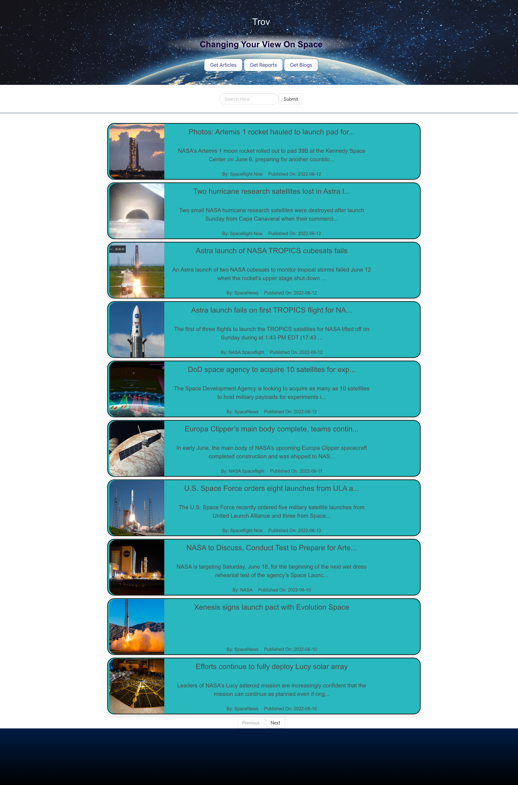

# Trov
## About
We are building Server-Side APIs from Spaceflight News and NASA. When you visit Trov, new and old articles/blogs/reports will be shown along with a new space image from Nasa will be shown daily.

AS A Astrologist Fan
I WANT to see news articles
SO THAT I can stay up to date with the happenings in our universe.

GIVEN a dashboard with form inputs
WHEN I search for an article
THEN I am presented with various articles that I can choose from to read
WHEN I am choosing my article we have a stunning view of what is showing from the NASA Website
## Made With:
* jQuery
* bulma
* javascript
* html5
* css
### APIs
* Spaceflight News - articles/blogs/reports are updated constantly
* NASA - space image updated daily

## Live Page
Deployed Page: https://sarahstelljes.github.io/Trov/

## Image

